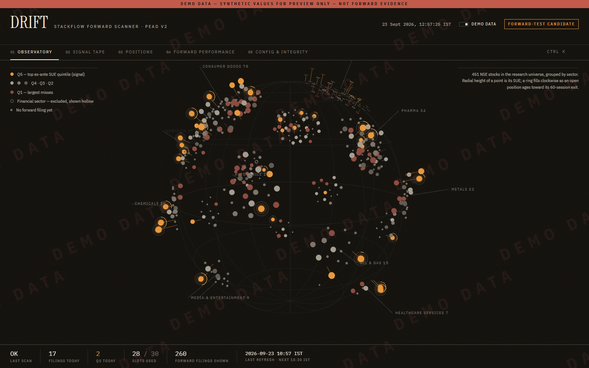
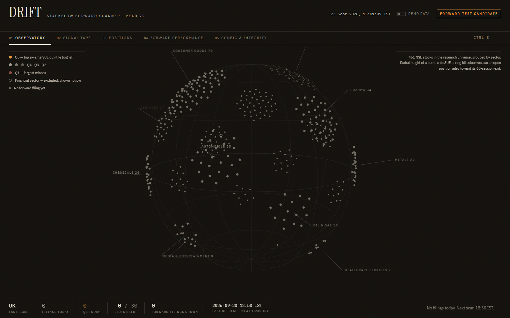
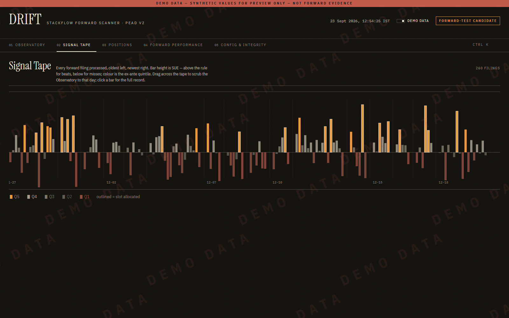
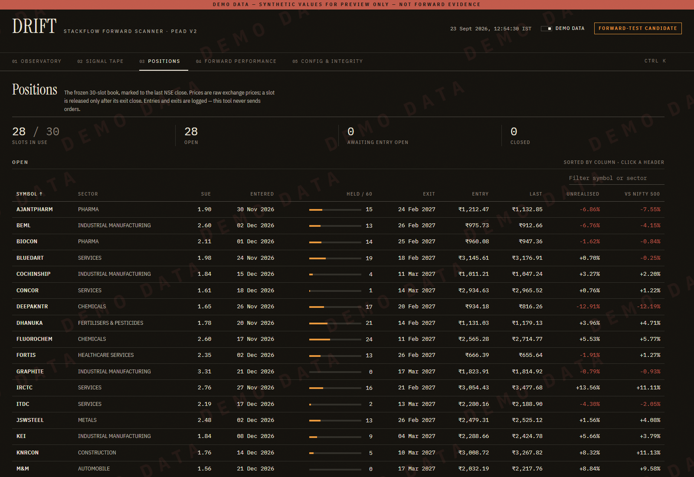
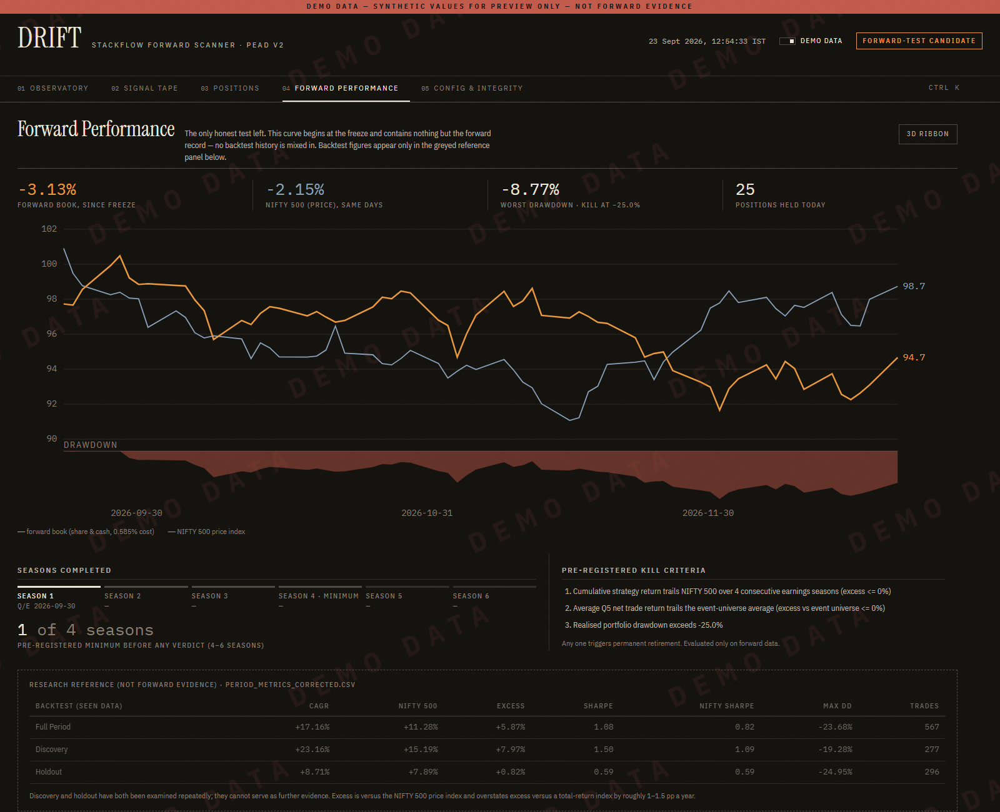
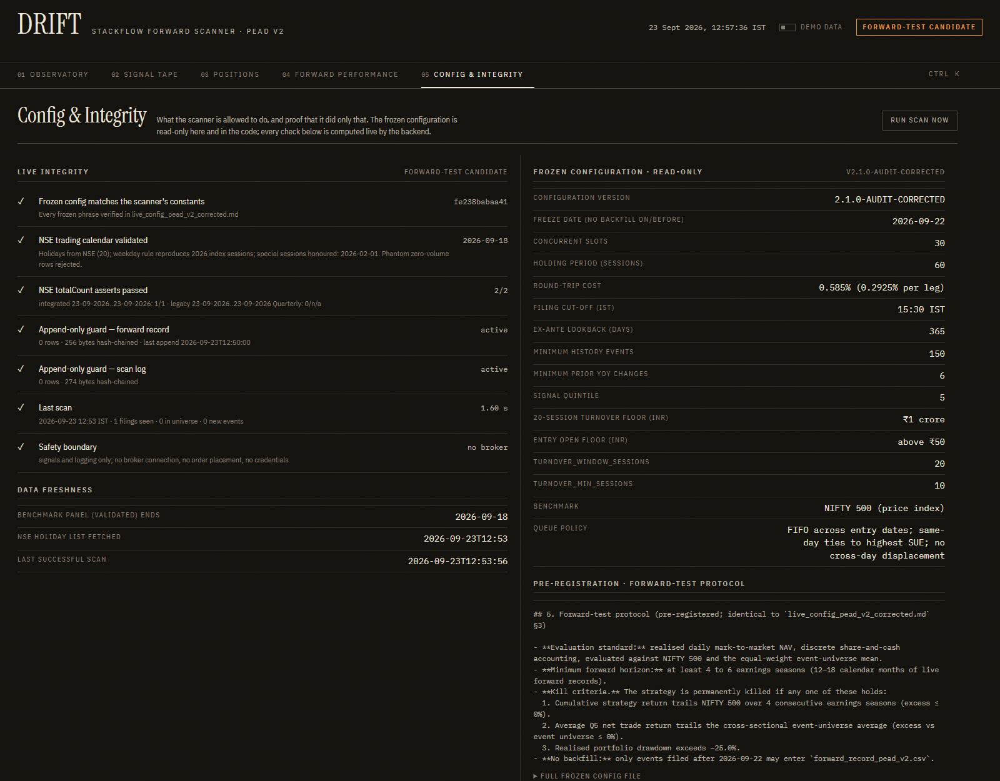

# DRIFT — StackFlow Forward Scanner & Observatory

<div align="center">


<p align="center">
  <b>A quantitative forward-testing platform and financial observatory for Post-Earnings-Announcement Drift (PEAD v2) across the National Stock Exchange (NSE) universe.</b>
</p>

</div>

---

## 📌 Executive Summary

**DRIFT** is an institutional-grade quantitative forward scanner and 3D visual observatory designed to run the frozen **PEAD v2** strategy (`research/pead_v2/live_config_pead_v2_corrected.md`, v2.1.0-AUDIT-CORRECTED) in real-world forward conditions.

* **Core Premise:** The earnings surprise signal (SUE) is verified and statistically sound; the forward record provides an append-only, tamper-proof audit trail for real-time validation without look-ahead bias.
* **Architecture:** Decoupled FastAPI analytical backend (`stackflow/app/backend`) running daily scans at 18:30 IST paired with a React 19 + Three.js / React Three Fiber interactive frontend (`stackflow/app/frontend`).
* **Zero-Credential Security:** DRIFT generates and logs signals only. It contains no broker integrations, executes no live market orders, handles no credentials, and maintains zero write-access to external brokerage accounts.

---

## 📸 Interface & Observatory

### 01 · Planetary Observatory
*451 stocks projected onto a 3D celestial sphere, grouped into sector constellations with real-time particle streams for incoming earnings filings.*

| Observatory (Demo Mode) | Observatory (Live Feed) |
|:---:|:---:|
|  |  |

### 02 · Signal Tape & Execution Ledger
*Live chronological feed of parsed corporate filings, ex-ante quintile categorizations, and allocation statuses.*

| Signal Tape (Scrubber View) | Execution Positions & Allocation |
|:---:|:---:|
|  |  |

### 03 · Performance & Cryptographic Integrity
*Forward-only equity curve, drawdown diagnostics, and live SHA-256 chain verification.*

| Forward Equity Curve vs NIFTY 500 | System Health & Cryptographic Chain |
|:---:|:---:|
|  |  |

---

## 🛡️ Core Guarantees & Quantitative Guardrails

1. **Cryptographic Append-Only Ledger (`drift/ledger.py`):**
   * Every append to the forward record recalculates file byte length and SHA-256 hash stored in tamper-evident chain files (`*.chain.json`).
   * Any manual edit, record deletion, reordering, or timestamp alteration triggers a `TamperError` and halts all scans immediately.
   * Backfilling rows dated on or prior to strategy freeze (2026-09-22) is rejected with `BackfillError`.
2. **Zero Look-Ahead Bias:**
   * Ex-ante SUE quintile thresholds are calculated strictly using qualifying announcements timestamped in $[T - 365\text{d}, T)$.
   * A filing never observes concurrent or later filings within the same scan batch.
   * Entry orders execute at the market open of the session **following** the announcement day ($T+1$).
3. **Conservative Cost & Liquidity Filter:**
   * Net performance accounts for a 0.585% total transaction drag (brokerage, STT, exchange fees, slippage).
   * Stocks must meet liquidity requirements (20-session turnover $\ge$ ₹1 crore and open price > ₹50).
   * Strict financial exclusions applied to Banking and NBFC institutions.
4. **Anti-Silent Failure Assertion:**
   * Exchange ingestion asserts `rows >= totalCount` on paged NSE API responses. Incomplete feeds abort execution rather than processing truncated data.

---

## 🚀 Quickstart & Local Run

### Prerequisites
* **Python 3.11+**
* **Node.js 20+** with npm

### 1. Backend Service (FastAPI)

```bash
# Install backend dependencies
pip install -r stackflow/app/backend/requirements.txt

# Start backend server on port 8765
python -m uvicorn drift.api:app --app-dir stackflow/app/backend --port 8765
```

* **API Swagger Docs:** `http://127.0.0.1:8765/docs`
* **Scheduled Scanner:** Executes automatically at **18:30 IST**. Disable during development by setting `DRIFT_SCHEDULER=0`.
* **Manual Scan:** Send `POST http://127.0.0.1:8765/scan/run`.

### 2. Frontend Interface (Vite + React)

```bash
# Install frontend dependencies
npm --prefix stackflow/app/frontend install

# Launch development server
npm --prefix stackflow/app/frontend run dev
```

* Open **`http://localhost:5173`** in your browser.
* API requests (`/api/*`) proxy automatically to `http://127.0.0.1:8765`.

### 3. Run Test Suite

```bash
# Run 64 deterministic unit and integration tests
python -m pytest -q stackflow/app/backend
```

---

## ⚙️ Environment Variables

| Variable | Default | Purpose |
|:---|:---|:---|
| `DRIFT_SCHEDULER` | `1` | Enable/disable automatic 18:30 IST scheduled daily scan thread (`0` = disabled) |
| `DRIFT_DATA_DIR` | `stackflow/app/backend/data` | Working directory for price caches, raw filings, state, and ledger chains |
| `DRIFT_FORWARD_RECORD` | `stackflow/research/pead_v2/forward_record_pead_v2.csv` | Canonical append-only forward strategy record |
| `DRIFT_API` | `http://127.0.0.1:8765` | Target backend URL for Vite reverse proxy |

---

## 📂 Project Structure

```
.
├── .gitignore                                 # Git ignore rules (bytecode, editor configs)
├── README.md                                  # Repository documentation
├── stackflow/
│   ├── app/
│   │   ├── backend/                           # FastAPI service
│   │   │   ├── drift/                         # Scanner, ledger, calendar, NSE engine
│   │   │   ├── tests/                         # 64 automated test specifications
│   │   │   └── requirements.txt               # Backend dependencies
│   │   ├── frontend/                          # React 19 + TypeScript + Three.js app
│   │   │   ├── src/                           # 3D Observatory, tape, performance screens
│   │   │   ├── package.json                   # Frontend dependencies
│   │   │   └── vite.config.ts                 # Build & proxy configuration
│   │   └── docs/screenshots/                  # UI walkthrough visual assets
│   ├── data_pipeline/                         # XBRL financial filing ingestion
│   ├── research/                              # Quantitative models & PEAD v2 research papers
│   ├── cache/                                 # Historical sessions & constituent panels
│   └── results/                               # Backtest grids & robustness audits
```

---

## 📊 Core API Endpoints

| Method | Route | Description |
|:---|:---|:---|
| `GET` | `/status` | System health badge, scan schedule, slots utilized, and active signals count |
| `POST` | `/scan/run` | Execute forward pipeline immediately; returns detailed scan execution log |
| `GET` | `/signals/today` | Filtered earnings signals and allocations generated during today's scan |
| `GET` | `/positions/open` | Active held positions, session counts (held out of 60), and unrealised returns |
| `GET` | `/forward/performance`| Forward equity curve, drawdown metrics, and comparison against NIFTY 500 |
| `GET` | `/universe/map` | Universe mapping of 451 tracked symbols, sectors, and historical filing status |
| `GET` | `/config` | Read-only view of frozen quantitative configuration and SHA-256 verification |
| `GET` | `/health` | Verification of calendar validation, totalCount assertions, and ledger chains |

---

<div align="center">
  <sub>StackFlow Quantitative Research · PEAD v2 Engine · Strict Append-Only Audit Trail</sub>
</div>
