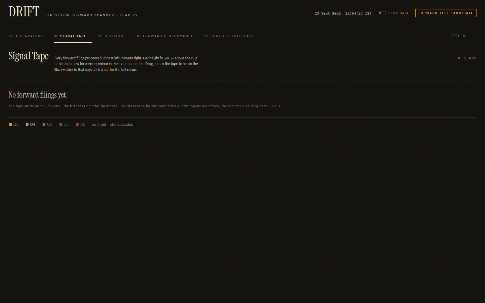
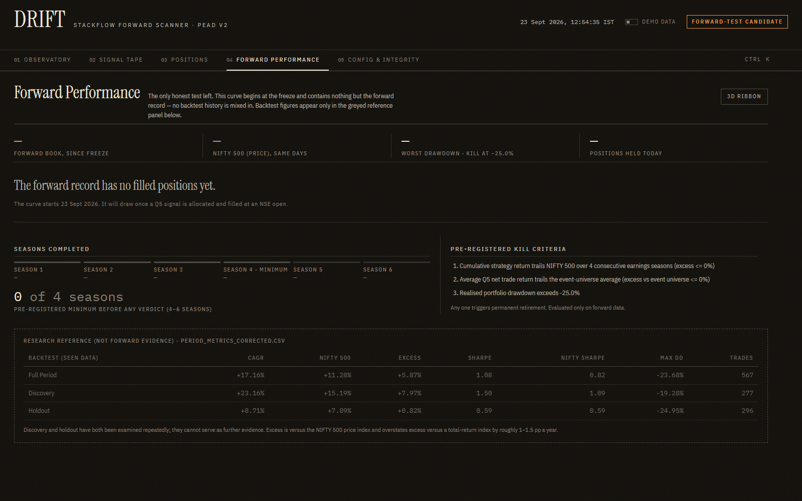
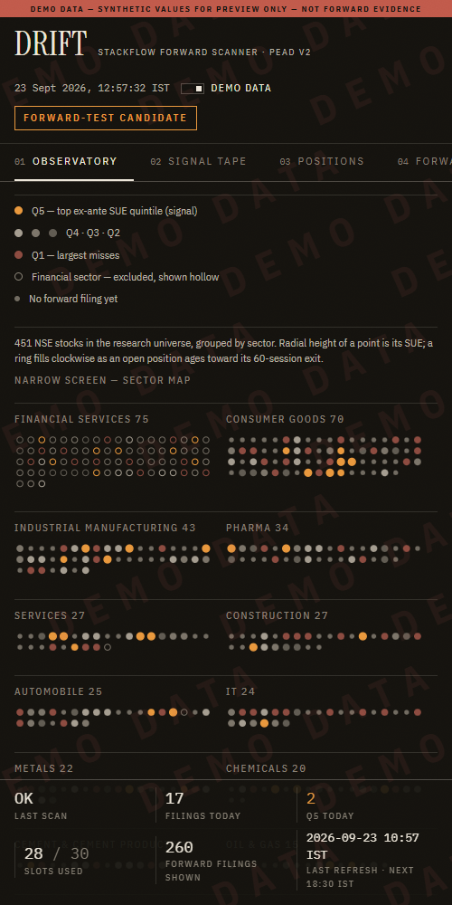
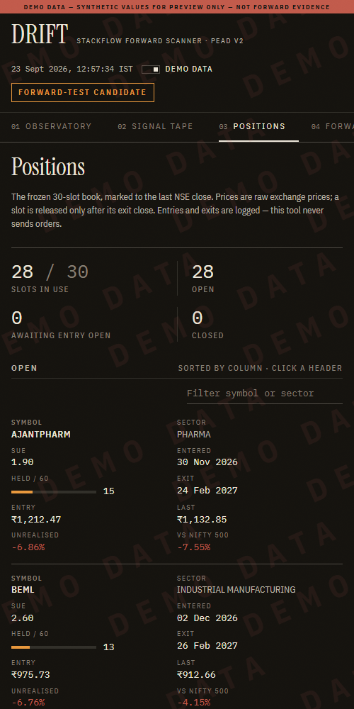

# DRIFT — StackFlow Forward Scanner

- **What it is:** a forward scanner and an instrument-style interface for the PEAD V2 strategy.
- **Status:** **FORWARD-TEST CANDIDATE**. The signal is confirmed; the strategy is *not validated* (`research/pead_v2/CORRECTED_REPORT.md`).
- **Why it exists:** the forward record is the only clean test left, and this app runs it.

> **Safety.** DRIFT generates and logs signals only. It has no broker integration, places no orders, handles no credentials, and has no "execute" control anywhere.

```
stackflow/app/
  backend/    FastAPI scanner, scheduler, append-only ledgers, 64 tests  (see backend/README.md)
  frontend/   React + Vite + TypeScript, React Three Fiber + drei, D3 (scale/shape) charts, Framer Motion
  docs/screenshots/
```

## Run locally

**Backend** (Python 3.11+). From the repository root:

```bash
pip install -r stackflow/app/backend/requirements.txt
```

```bash
python -m uvicorn drift.api:app --app-dir stackflow/app/backend --port 8765
```

- The daily scan runs at **18:30 IST** automatically. Set `DRIFT_SCHEDULER=0` to disable it.
- For a one-off scan, use `POST http://127.0.0.1:8765/scan/run`, or **Run scan now** on the Config & Integrity screen.

**Frontend** (Node 20+):

```bash
npm --prefix stackflow/app/frontend install
```

```bash
npm --prefix stackflow/app/frontend run dev
```

- Open http://localhost:5173. `/api/*` is proxied to `http://127.0.0.1:8765` (override with `DRIFT_API`).
- For a production bundle, run `npm --prefix stackflow/app/frontend run build`, then `npm --prefix stackflow/app/frontend run preview`.

**Tests:**

```bash
python -m pytest -q stackflow/app/backend
```

## Where the data comes from

| input | source | used for |
|---|---|---|
| New result filings | NSE `/api/integrated-filing-results` (paged, `&size=2000`, **rows ≥ totalCount asserted**) and `/api/corporates-financial-results` | events |
| Profit after tax | the filing's XBRL, parsed by the **existing locked parser** `data_pipeline/xbrl/scripts/parse_xbrl.py` | SUE |
| Historical PAT series | `data_pipeline/xbrl/cache/extract_universe.csv` (read-only) | SUE denominators |
| Ex-ante threshold pool | `research/pead_v2/corrected/pead_v2_events_corrected.csv` (read-only), then forward events | quintiles |
| Trading calendar | NSE holiday master + NIFTY 500 index sessions (`cache/sector_close_panel.csv`) | event day, entry, exit |
| Prices | Yahoo Finance `.NS`, raw (`auto_adjust=False`), currency asserted `INR`, filtered to NSE sessions | filters, fills, marks |
| Benchmark | NIFTY 500 price index: the validated panel, then `^CRSLDX` | excess |
| Frozen configuration | `research/pead_v2/live_config_pead_v2_corrected.md` — **never written**; checked for consistency on every scan | all parameters |

## Guarantees

- **Append-only forward record.**
  - `research/pead_v2/forward_record_pead_v2.csv` keeps its frozen 20-column schema and is only ever appended to.
  - Its byte length and SHA-256 are chained after every append. Any edit, deletion or out-of-band write stops all scans with `TamperError`.
  - Rows dated on or before the freeze (2026-09-22) are refused.
  - A signal's life (QUEUED → ENTER → OPEN → CLOSED, or REJECTED) is recorded as new rows, never as edits.
- **No look-ahead.**
  - Thresholds use only filings timestamped strictly before the filing being scored.
  - Entry is the open of the session *after* the event day.
  - A same-day allocation is final only once no competing filing can still arrive (15:30 IST on the session before entry).
  - Realised outcomes are filled only when the price actually exists.
- **No silent caps.** A short NSE fetch aborts the scan rather than looking like a quiet day.
- **No fabricated data.**
  - Empty feeds show empty states.
  - **Demo mode** exists only behind the header toggle (or `?demo=1`). It stamps DEMO DATA across every screen, uses a simulated post-freeze window, and is never written anywhere.
  - The Integrity screen always shows the real system.
- **No mixing.** The forward-performance curve starts at the freeze. Backtest numbers appear only in a greyed "Research reference (not forward evidence)" panel.

## Screens

**Key:** *live* = real system state today (23 Sep 2026: off-season, no filings yet) · *demo* = synthetic, stamped.

### 01 Observatory — the NSE universe as a planetarium

- 451 stocks sit on a spherical shell, grouped into sector constellations.
- **Point encoding:**
  - radial height = SUE; colour = ex-ante quintile (Q5 amber, Q1 dim red)
  - financials drawn hollow: excluded, not hidden
  - open positions carry a ring that fills clockwise over 60 sessions
- New filings arrive as particles.
- **Interaction:**
  - idle auto-orbit, damped drag
  - click a sector to fly to it
  - `Ctrl/Cmd+K` to jump to a symbol
- On narrow screens, weak devices or without WebGL it becomes a 2D sector map.


### 02 Signal Tape

- Every filing processed appears as a bar: height = SUE, colour = quintile, outline = slot allocated.
- Drag across the tape to scrub the Observatory to that day.
- Click a bar for the full record, including the four thresholds in force at filing time.




### 03 Positions

- A precise, sortable, filterable table: days held out of 60, entry, last, unrealised, and excess vs NIFTY 500.
- Closed positions are listed below.
- On mobile the table becomes cards.


### 04 Forward Performance

- **Curve:** the forward-only equity curve against NIFTY 500 (price), with its drawdown.
- **Seasons:** completed seasons against the pre-registered 4–6, with the kill criteria beside them.
- **3D ribbon:** an optional view where width = positions held and colour = drawdown depth.
- **Research reference:** discovery and holdout sit in a separate greyed panel.




### 05 Config & Integrity

- **Frozen config:** read-only, with its SHA-256.
- **Live checks:** calendar validated, totalCount asserts, append-chain status per ledger, last scan duration and data freshness.
- **Pre-registration:** the forward-test protocol is shown verbatim.


### Mobile




## Design notes

- **Palette:** warm charcoal `#15130f`, bone `#ece5d8`, one accent (amber `#e8963c`) used only for Q5 and active signals, steel-blue `#86a0b8` for the benchmark, and a restrained red `#c0594a` for losses. There are no other colours.
- **Type:** Instrument Serif for headlines, IBM Plex Sans Condensed for labels, and IBM Plex Mono for every number (tabular, slashed zero), so updating digits never shift.
- **Layout:** a broadsheet grid with hairline rules, not floating cards. Film grain sits at 5.5% opacity, with no blur blobs.
- **Motion carries information only:** filing arrivals, rolling number changes, holding rings and camera fly-to. `prefers-reduced-motion` gives a fully static version: no auto-orbit, no particles, no rolls.
- **Performance:** instanced meshes for the 451 points, and a lazy-loaded three.js chunk that is never fetched on the 2D screens.
- **Accessibility:** sector labels are a projected DOM overlay (no per-label React roots), so every label is a real, focusable button. Keyboard: `1`–`5` switch screens, `Ctrl/Cmd+K` opens the command palette, `Esc` closes drawers. Focus is visible.
